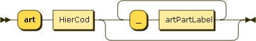

# Identificador de fragmento

Para obter o conteúdo de um fragmento de documento, ou seja, uma porção fixada por sua estrutura, basta designar o [*identificador de fragmento*](https://en.wikipedia.org/wiki/Fragment_identifier) (**fragId**) do fragmento desejado.

Como os documentos normativos (eg. normas técnicas e legislação) e os contratos são todos formatados da mesma forma (usando [HTML5 simplificado](https://github.com/ppKrauss/HTML5-onlyContent), XML [ISOSTS](http://www.iso.org/schema/isosts/v1.0/doc/) ou XML [LexML](http://projeto.lexml.gov.br/documentacao/Parte-3-XML-Schema.pdf)) e com uma estrutura similar, pode-se designar os elementos estruturais como identificadores padronizados. A metodologia para a obtenção de IDs de "XML quaisquer" foi descrita em Krauss & Lima (2003).

A API `api.oficial.news/getfrag` faz esse "meio de campo", interpretando *identificadores padronizados*, expressos dentro de uma sintaxe bem definida (padrões compacto e alternativo), e extraindo o fragmento desejado de dentro do documento indicado.

A especificação completa da API se encontra em [getfrag-v1.0.0-swagger.yaml](getfrag-v1.0.0-swagger.yaml) (visualizar em [swaggerhub.com/ppKrauss/getfrag/1.0.0](https://app.swaggerhub.com/apis/ppKrauss/getfrag/1.0.0)).

## Sintaxe do *fragId*

A sintaxe completa é especificada por [EBNF](https://en.wikipedia.org/wiki/Extended_Backus%E2%80%93Naur_form) formato RDG (2017) em  [fragId-syntax.ebnf](fragId-syntax.ebnf). Ela consiste de uma string que expressa pelo esquema `CompactID` ou `LexID`, sendo que a presentação canônica (sempre existe e é mantida assim na base de dados) é a `CompactID`.

```ebnf
FragID  = CompactID | LexID
```

Abaixo a EBNF é traduzida para uma representação visual, em diagramas.


### Identificador canônico
Qualque tipo de documento (lei, norma técnica, contrato, licitação, etc.) pode ter seus fragmentos identifcados pelo `CompactID`:

```ebnf
CompactID = (FragType, HierInt ["i",  HierInt]) 
            | ("s", HierInt);
FragType  = "a" | "c" | "t" | "f";
HierInt   = Digit | (Digit, ".", HierInt);
digit = "0" | "1" | "2" | "3" | "4" | "5" | "6" | "7" | "8" | "9";
```
&nbsp; NOTA: EBNF colorida em [formato ISO 14977](https://en.wikipedia.org/wiki/Extended_Backus%E2%80%93Naur_form#Table_of_symbols).

Semântica:

* `a`: indica articulação, típica de leis e contratos tradiconais, onde a numeração decimal serial é usada no original (ex. "Artigo 5º" ou "Art. 5").

* `i`: item no sentido de subestrutura explícita e rotulada (com romanos, dígitos ou letras), tal como item, parágrafo ou alínea.

* `c`: cláusula, típica de contratos modernos, onde o único tipo de estrutura é a cláusula ou sub-cláusula, não se distingue articulação e seu agrupamento.

* `t`: tabela ou box flutuante de texto (sem ilustração), ou sua parte.

* `f`: figura (ilustração ou box com ilustração) ou sua parte.

* `s`: agrupamento de artigos ou cláusulas. Seções, capítulos ou títulos. Preferir `c` em caso de cláusulas-seção.

Itens e seções sem  numeração (rotulação de sequência) explícita no documento original, não podem ser referenciados por *FragId*  (recorre-se às convenções do tipo [XPointer](https://en.wikipedia.org/wiki/XPointer)).  Um parser amigável pode tratar o item posicionalmente quando da ausência de um ID no elemento estrutal.

Exemplos: `a5` (artigo 5), `a5.2` (artigo 5b), `a5i2` (item II do artigo 5), `a5.1i2` (item II do artigo 5b), `a5.1i2.5` (item V do parágrafo 2 do artigo 5b), `c5` (cláusula 5), `c5.1.2` (cláusula 5.1.2), `t3` (tabela 3), `t3.2` (bloco 2 da tabela 3), `t3i2` (linha 2 da tabela 3), `f4` (figura 4), `f4i1` (item 1 da figura 4), `s2` (seção 2), `s2.1` (subseção 1 da seção 2).

NOTA: como variante **não-canônica** pode-se permitir o uso de *numerais romanos* no lugar dos dígitos decimais (*HierInt* é abreviação de "hierarchical integer").

### Identificador alternativo LexML
Como alternativa à convenção de identificação canônica (garantida na representação interna na base de dados), pode-se expressar os mesmos identificadores, no caso de legislação e contratos. Convenções adotadas por Lima & Ciciliati (2008), fixando-se a versão 1.0 da norma LexML:

Convenções para artigo e dispositivos de artigo<br/>


Dos exemplos se percebe a seguinte generalização:<br/>


```ebnf
ArtID     = "art", HierCod, {"_", artPartLabel};
ArtPart   = artPartLabel, HierCod;
HierCod   = digit, {"-", HierCode};
artPartLabel = "cpt" | "par" | "inc" | "ali" | "ite";
```

Agrupamento (hierárquico) de artigos<br/>


Dos exemplos se persebe a seguinte generalização:<br/>


```ebnf
SecID        = secPartLabel, HierCod {"_", SecID};
secPartLabel = "tit" | "prt" | "liv" | "cap" | "sec" | "sub";
```

## Ver também

Sumário das fontes relevantes. Elas complementam a formalização dos *inputs* e *outputs* do *microservice* `getfrag`, e a especificação dos IDs:

* Metodologia geral de mapeamento em IdFrag padronizado: Krauss & Lima (2003).
* Recomendação de padronização de IDs do LexML: tabelas 2 e 3 de Lima & Ciciliati (2008).
* Especificação OpenAPI da  `api.oficial.news/getfrag`: Krauss (2017).
* [fragId-syntax.ebnf](fragId-syntax.ebnf).
* [fragId-syntax-fig.xhtml](fragId-syntax-fig.xhtml).
* [getfrag-v1.0.0-swagger.yaml](getfrag-v1.0.0-swagger.yaml).

## Referências

* Krauss & Lima (2003) *"Notação Canônica para a Citação de Trechos de Normas Estatutárias Jurídicas Brasileiras"*, http://www.nilc.icmc.usp.br/til/til2003/poster/krauss_Lima2.pdf

* Krauss (2017) *"OPEN API specification of `api.oficial.news/getfrag`"*, https://app.swaggerhub.com/apis/ppKrauss/getfrag/1.0.0

* Lima & Ciciliati (2008) *"LexML Brasil, Parte 3 – LexML XML Schema"*, http://projeto.lexml.gov.br/documentacao/Parte-3-XML-Schema.pdf

* RDG - Railroad Diagram Generator (2017), http://www.bottlecaps.de/rr/ui ([opcional](https://github.com/Chrriis/RRDiagram)). Acessado em julho de 2017.
